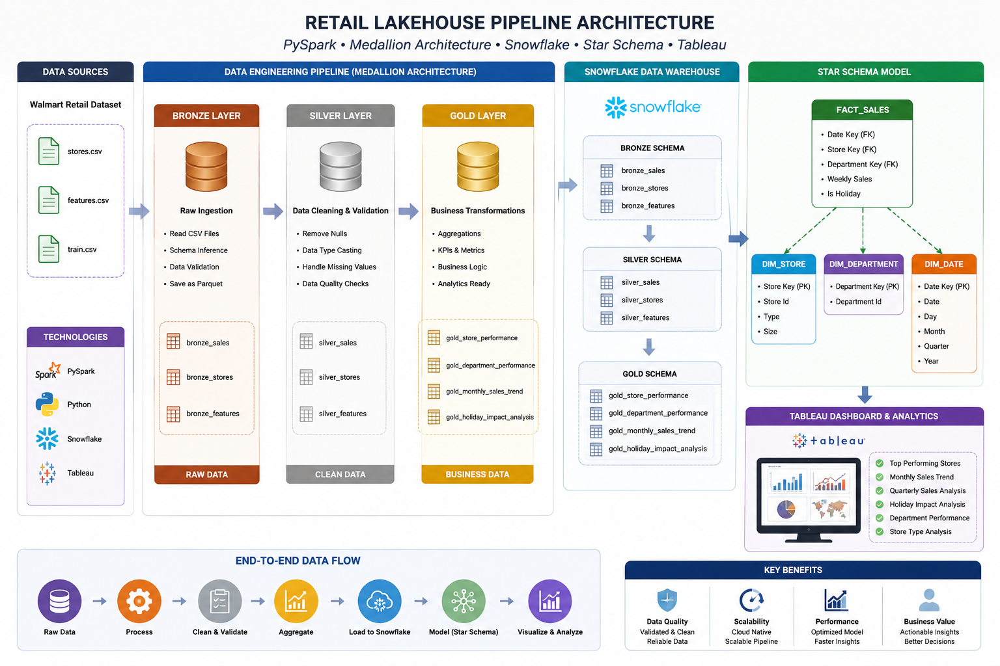
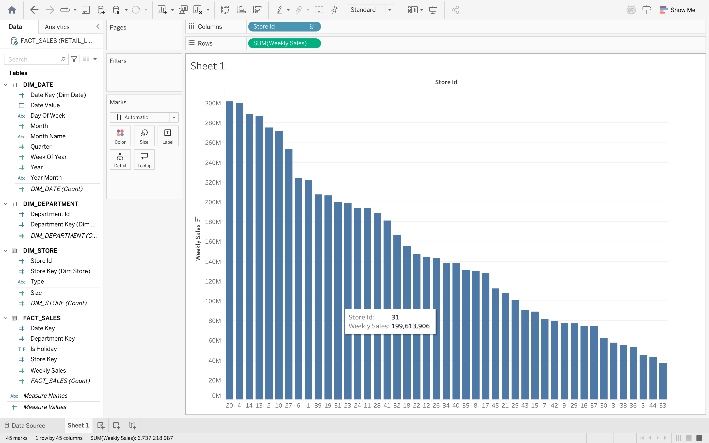
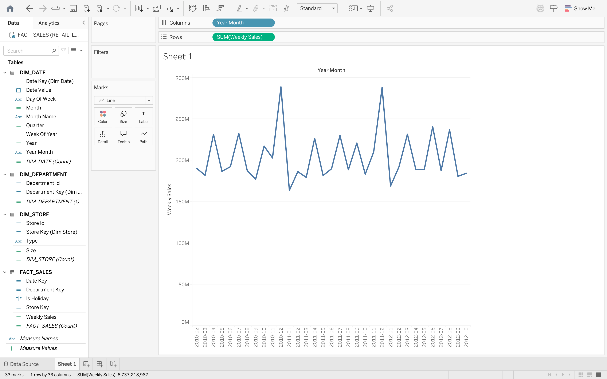
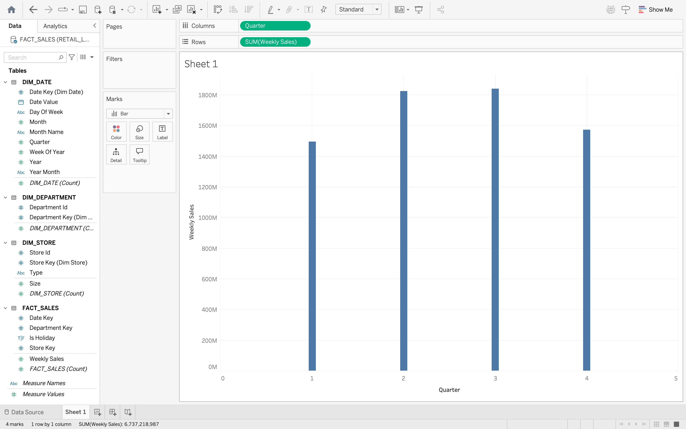
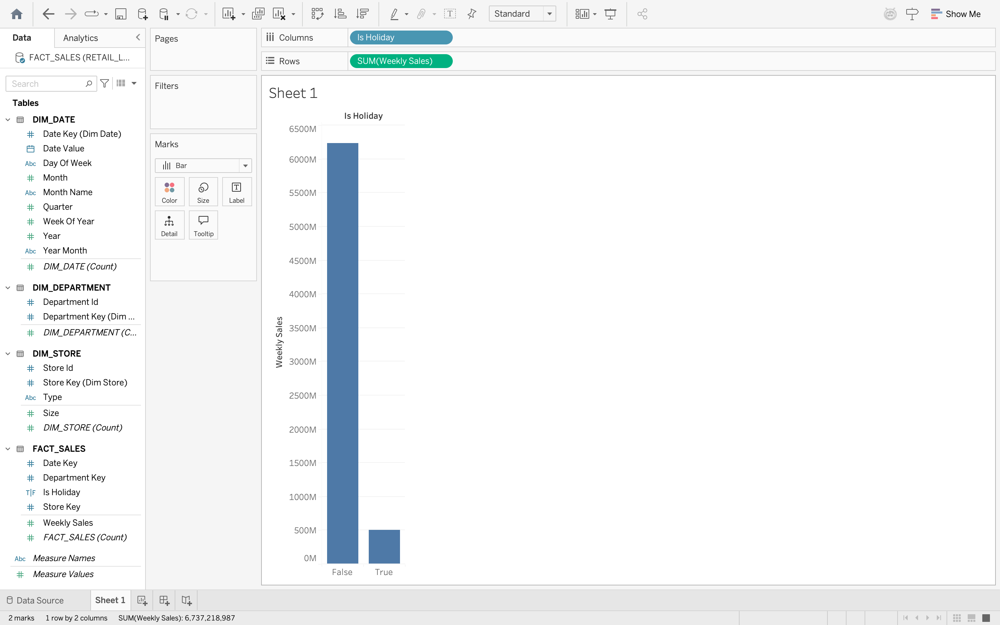
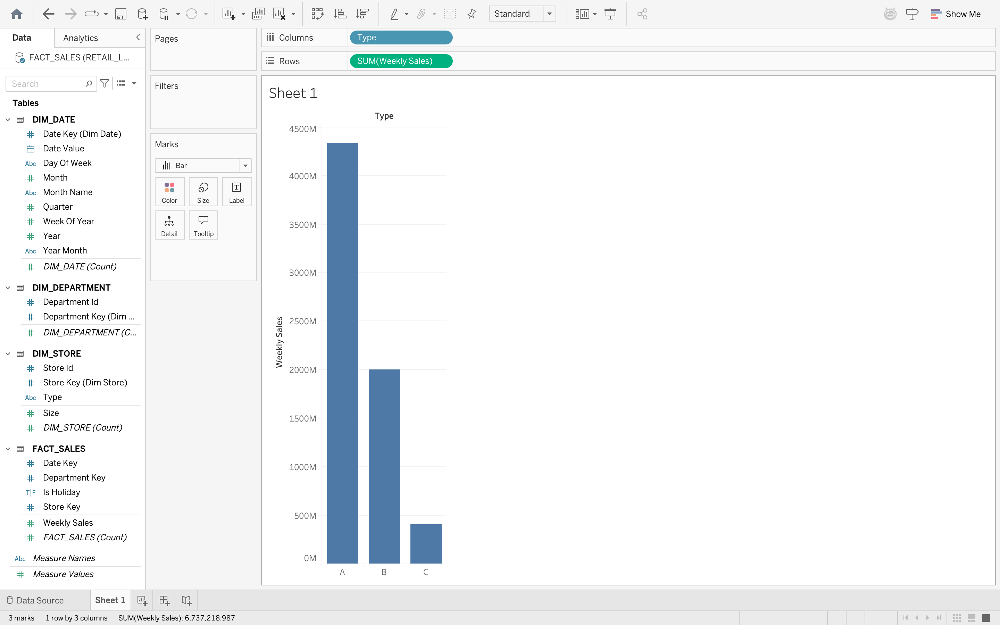
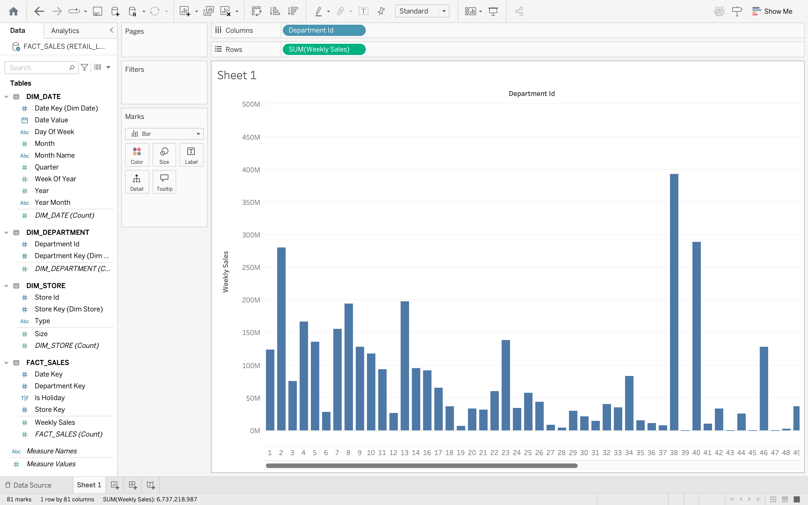
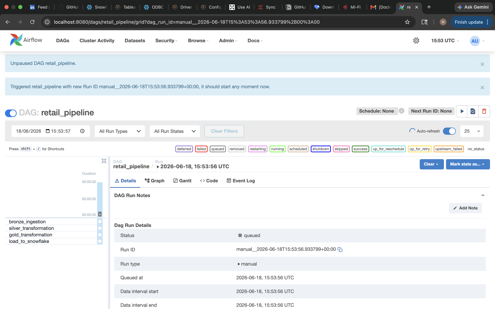
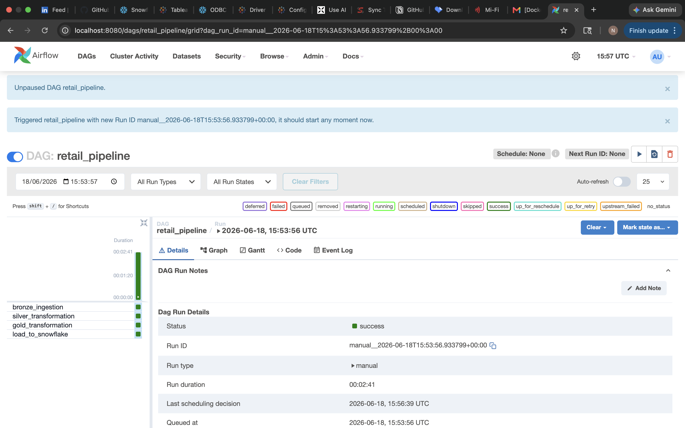
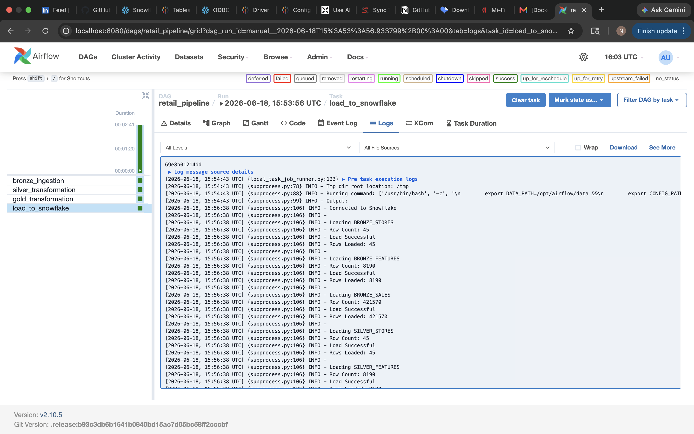

# 🛒 Retail Lakehouse Pipeline | End-to-End Data Engineering Project

<<<<<<< HEAD
### 📌 Project Overview
=======
## 📌 Project Overview

This project demonstrates the design and implementation of a modern Data Engineering solution using the Medallion Architecture (Bronze, Silver, Gold) with PySpark, Snowflake, and Tableau.

The pipeline ingests raw retail sales data, performs data quality validations and transformations, loads curated datasets into Snowflake, builds a dimensional data model using a Star Schema, and delivers business insights through interactive Tableau dashboards.

<<<<<<< HEAD
### 🎯 Business Objective
=======
## 🎯 Business Objective

Retail organizations generate large volumes of transactional data from stores, departments, and promotions.

The objective of this project is to:

* Build a scalable data pipeline using PySpark
* Implement Medallion Architecture (Bronze → Silver → Gold)
* Store optimized datasets in Parquet format
* Load curated data into Snowflake
* Design a Star Schema for analytical reporting
* Visualize business KPIs using Tableau
* Generate actionable insights for business stakeholders

## 🏗️ Solution Architecture

## Data Flow

Raw CSV Files
→ Bronze Layer
→ Silver Layer
→ Gold Layer
→ Snowflake Data Warehouse
→ Star Schema
→ Tableau Dashboards
→ Business Insights

## 🛠️ Technology Stack
Technology                                         Purpose

Python                                             Core Programming
PySpark                                            Distributed Data Processing
Parquet                                            Optimized Storage Format
Snowflake                                          Cloud Data Warehouse
SQL                                                Data Modeling & Analytics
Tableau                                            Business Intelligence & Visualization
GitHub                                             Version Control
YAML                                               Configuration Management

## 🥉 Bronze Layer

### Purpose

The Bronze Layer stores raw ingested data with minimal modifications.

Source Files

* stores.csv
* features.csv
* train.csv

Transformations

* Schema Inference
* Metadata Enrichment
* Load Timestamp Addition
* Source File Tracking

Output

* bronze_stores
* bronze_features
* bronze_sales

Stored in Parquet format.

## 🥈 Silver Layer

### Purpose

The Silver Layer performs data cleansing, standardization, and quality validation.

Data Quality Rules Implemented

* Duplicate Removal
* Column Standardization
* Data Type Conversion
* Null Handling
* Negative Sales Validation
* Business Column Preservation

Output

* silver_stores
* silver_features
* silver_sales

## 🥇 Gold Layer

### Purpose

The Gold Layer contains business-ready datasets optimized for analytics and reporting.

Gold Tables

GOLD_STORE_PERFORMANCE

Store-level sales metrics.

GOLD_DEPARTMENT_PERFORMANCE

Department-level sales metrics.

GOLD_MONTHLY_SALES_TREND

Monthly aggregated sales trends.

GOLD_HOLIDAY_IMPACT_ANALYSIS

Holiday vs Non-Holiday sales analysis.

## ❄️ Snowflake Data Warehouse

All Bronze, Silver, and Gold datasets are loaded into Snowflake using Python and the Snowflake Connector.

Schemas

* BRONZE
* SILVER
* GOLD

Benefits

* Centralized Analytics Layer
* Scalable Cloud Storage
* Fast Query Performance
* Integration with Tableau

## ⭐ Star Schema Design

A dimensional data model was created in Snowflake to support analytical workloads.

## Fact Table
### FACT_SALES

Column
STORE_KEY
DEPARTMENT_KEY
DATE_KEY
WEEKLY_SALES
IS_HOLIDAY

## Dimension Tables
### DIM_STORE

Column
STORE_KEY
STORE_ID
TYPE
SIZE

### DIM_DEPARTMENT

Column
DEPARTMENT_KEY
DEPARTMENT_ID

### DIM_DATE

Column
DATE_KEY
DATE_VALUE
YEAR
MONTH
QUARTER
DAY_OF_WEEK
MONTH_NAME
YEAR_MONTH
WEEK_OF_YEAR

## Data Model

### FACT_SALES connects to:

* DIM_STORE
* DIM_DEPARTMENT
* DIM_DATE

using surrogate keys.

This design improves analytical performance and follows industry-standard dimensional modeling practices.

## 📊 Tableau Dashboard & Business Insights

The Star Schema was connected directly to Tableau Desktop to build business dashboards.

---

## 1. Top Performing Stores

### Insight

Store 20 generated the highest overall revenue, followed by Stores 4 and 14.

## 2. Monthly Sales Trend

### Insight

Sales patterns show seasonal fluctuations and recurring demand cycles throughout the year.

## 3. Quarterly Sales Analysis

### Insight

Quarterly trends reveal periods of stronger business performance and revenue concentration

## 4. Holiday Impact Analysis

### Insight

Holiday periods show stronger average sales compared to regular weeks, highlighting the impact of seasonal shopping behavior.

## 5. Store Type Analysis

### Insight

Type A stores contribute the majority of total sales volume.

## 6. Department Performance

### Insight

A small number of departments generate a significant portion of overall revenue.

## 📁 Project Structure
retail-lakehouse-pipeline/

├── config/
├── data/
│   ├── bronze/
│   ├── silver/
│   └── gold/
│
├── docs/
│   └── architecture_diagram.png
│
├── screenshots/
│   ├── top_performing_stores.png
│   ├── monthly_sales_trend.png
│   ├── quarterly_sales.png
│   ├── holiday_impact.png
│   ├── store_type_analysis.png
│   └── top_departments.png
│
├── scripts/
│   ├── bronze_ingestion.py
│   ├── silver_transformation.py
│   ├── gold_transformation.py
│   ├── load_to_snowflake.py
│   └── test_snowflake_connection.py
│
├── sql/
│   ├── star_schema.sql
│   └── business_analytics.sql
│
├── requirements.txt
└── README.md

## 🚀 Key Achievements

* Built an end-to-end Data Engineering pipeline
* Implemented Medallion Architecture
* Processed data using PySpark
* Stored optimized Parquet datasets
* Loaded curated data into Snowflake
* Designed a Star Schema data model
* Created Tableau dashboards for business reporting
* Generated meaningful business insights

<<<<<<< HEAD
=======
## Apache Airflow Orchestration

To automate the end-to-end data pipeline, Apache Airflow was integrated into the solution and deployed using Docker.

## Workflow Orchestration

The Airflow DAG orchestrates the complete Medallion Architecture workflow:

Bronze Ingestion → Silver Transformation → Gold Transformation → Snowflake Load

## DAG Components

* Bronze Layer Ingestion
* Silver Layer Data Quality & Standardization
* Gold Layer Business Aggregations
* Snowflake Data Warehouse Load

## Airflow Benefits

* Automated Pipeline Execution
* Dependency Management
* Task Monitoring
* Retry & Failure Handling
* Operational Visibility
* Production-Ready Orchestration Framework

## Airflow DAG Graph

## Successful Pipeline Execution

## Snowflake Load Task Logs

# 🚀 V3 Enhancements – Data Quality, Audit Framework & Incremental Processing

The Retail Lakehouse Pipeline was further enhanced with production-inspired Data Engineering capabilities focused on data reliability, monitoring, and incremental processing.

## ✅ Data Quality Framework

### Implemented automated data quality validations across Bronze and Silver layers:

* Row Count Validation
* Duplicate Detection
* Empty Dataset Validation
* Negative Sales Threshold Validation
* Pipeline Failure on Quality Threshold Breach

## ✅ Audit Layer

### Created a centralized audit framework to track pipeline health and validation results.

Audit checks include:

Pipeline Layer                          Validation

Bronze Stores                           Row Count Check
Bronze Features                         Row Count Check
Bronze Sales                            Row Count Check
Silver Stores                           Row Count Check
Silver Features                         Row Count Check
Silver Sales                            Negative Sales Check
Gold Store Performance                  Row Count Check
Gold Department Performance             Row Count Check
Gold Monthly Sales Trend                Row Count Check
Gold Holiday Impact Analysis            Row Count Check

Audit output captures:

* Pipeline Name
* Validation Type
* Actual Value
* PASS / FAIL Status
* Audit Timestamp

## ✅ Incremental Processing with Watermarks

### Implemented watermark-based incremental processing to simulate production ETL patterns.

Features:

* Maintains last processed business date
* Detects newly arrived records
* Prevents unnecessary full dataset processing
* Updates watermark automatically after successful processing
* Supports scalable incremental ingestion design

#### Example Watermark:
last_processed_date
2012-10-26

## ✅ Airflow Workflow Enhancement

### The Airflow DAG was extended to include Data Quality and Incremental Processing stages.

Final Workflow:
Bronze Ingestion
        ↓
Silver Transformation
        ↓
Gold Transformation
        ↓
Data Quality Audit
        ↓
Incremental Processing
        ↓
Snowflake Load

## 📊 Monitoring & Observability

Apache Airflow provides:

* DAG Visualization
* Task Dependency Management
* Execution Monitoring
* Task-Level Logging
* Audit Tracking
* Incremental Processing Visibility

## 🏗️ Production Features Implemented

* Medallion Architecture (Bronze, Silver, Gold)
* PySpark Data Processing
* Snowflake Data Warehouse Integration
* Tableau Reporting & Analytics
* Docker Containerization
* Apache Airflow Orchestration
* Data Quality Framework
* Audit Layer
* Watermark-Based Incremental Processing
* End-to-End Pipeline Monitoring

### 👨‍💻 Author

Neela Konda Reddy Beeram

Data Engineer | PySpark | Snowflake | SQL | AWS | Tableau
